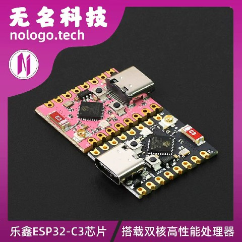

# 成品制作

## 1.制作PCB
嘉立创是个好平台，我们普通人也能有自己的电路板，不再买现成。下载[Gerber文件](Gerber_PCB1.zip)

然后去[下单](https://www.jlc.com/newOrder/#/pcb/newOnlinePlaceOrder)

那些乱七八糟的选项建议你自己去哔哩哔哩找教程

## 2.购买清单
点击前往[立创商城](https://www.szlcsc.com/)购买

| 购买类型 | 商品编号 | 物料编码 | 商品分类 | 名称 | 商品型号 | 品牌 | 封装规格 | 单个毛重 | 购买数量 | 商品单价(元) | 金额(元) |
| :--- | :--- | :--- | :--- | :--- | :--- | :--- | :--- | :--- | :--- | :--- | :--- |
| 现货 | C5248081 | | OLED显示屏 | 0.91寸OLED显示屏白光IIC 袋装 | HS91L02W2C01 | HS(汉昇) | - | 0.004000000 | 1 | 13.3248 | 13.32 |
| 现货 | C393942 | | 轻触开关 | 4.55*1.8*3.5mm 卧贴 轻触开关 编带 | TS24CA | SHOU HAN(首韩) | SMD,4.6x1.8mm | 0.000014000 | 20 | 0.1463 | 2.93 |
| 现货 | C318884 | | 轻触开关 | 5.1*5.1*1.5mm 立贴 轻触开关 编带 | TS-1187A-B-A-B | XKB Connection(中国星坤) | SMD-4P,5.1x5.1mm | 0.000120000 | 20 | 0.119795 | 2.40 |

## 还有一个！这是最重要的，焊接在上面的ESP32C3Supermini板，前往[淘宝链接](https://e.tb.cn/h.iDP8ZVub4aucZ95?tk=caKT5mTyN8t)购买

这和那些山寨版是不一样的，他们是旧版的，不仅信号不稳定，发热，有可能连芯片都是假的！一定要花这个钱去买，支持这个开发板原作者的劳动成果！

## 3.额外附加
要让这个东西更安全，更美观一点，可以加一个外壳，推荐去[嘉立创3D](https://www.jlc-3dp.cn/placeOrder)，他们每个月都送优质耗材的免费券😋

还能来个赠品，有笔记本和珊瑚笔筒，只需要邮费五元😋

[上面的壳](3DShell_3DShell_PCB1_T.stl) [下面的壳](3DShell_3DShell_PCB1_B.stl)
